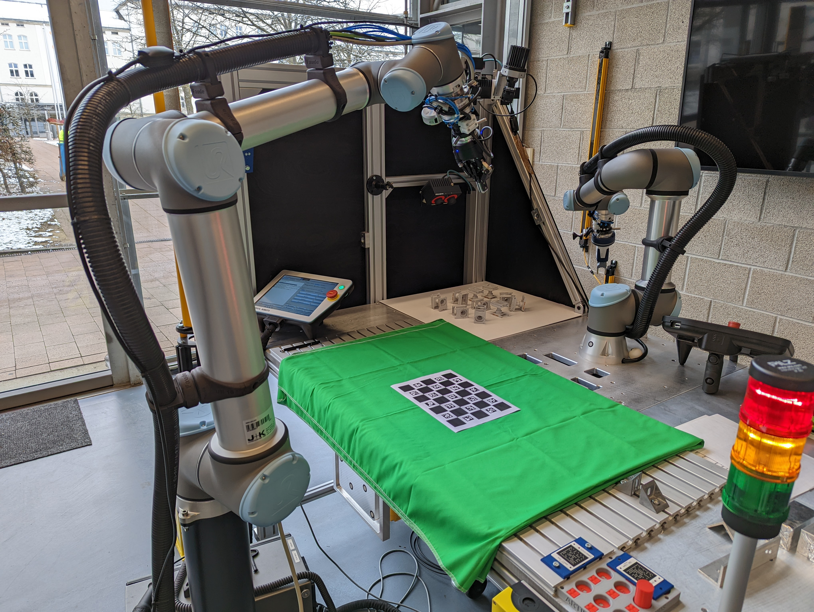
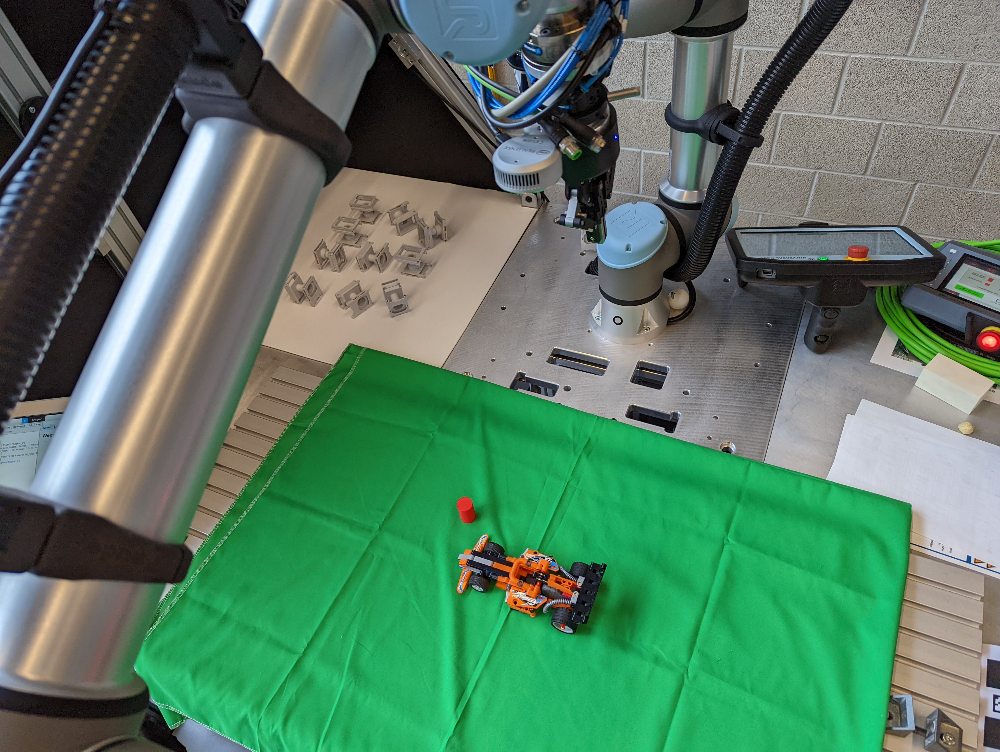
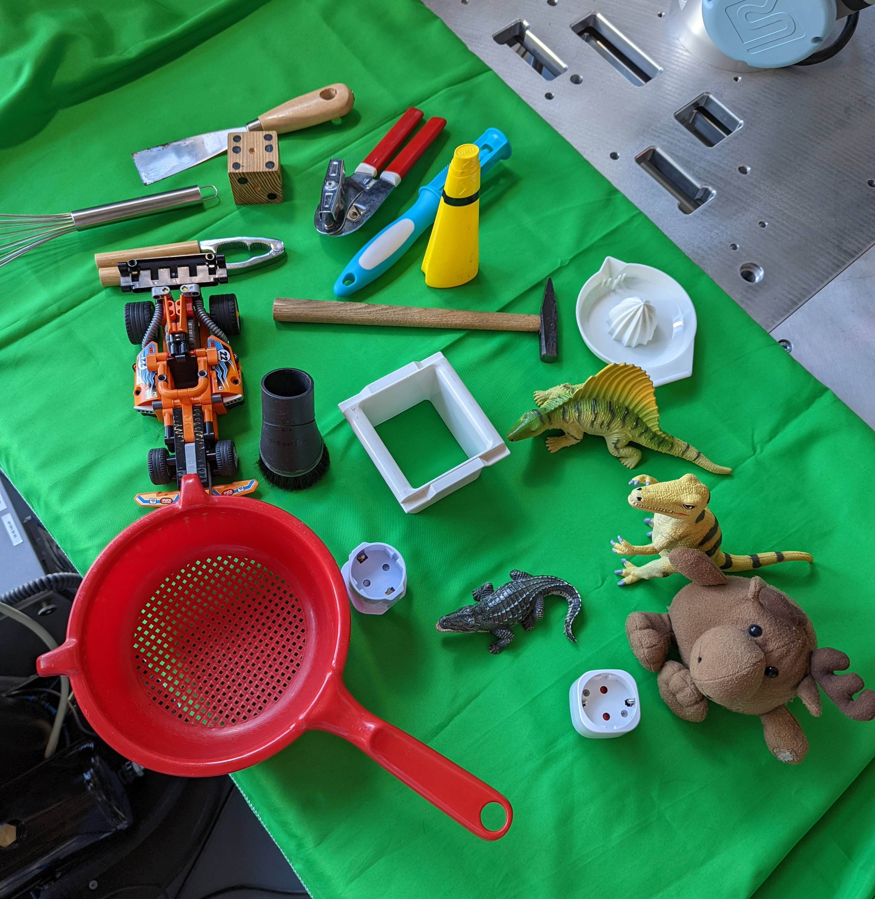
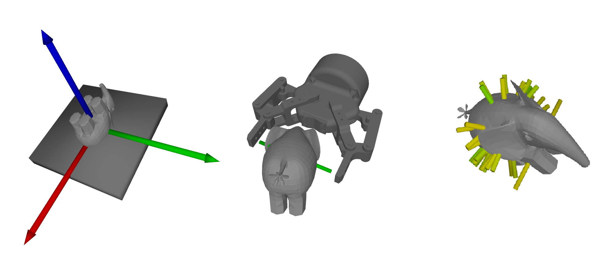

# Robust Grasp Planning with Deep Learning on a UR10e

> Bachelor thesis — applying Berkeley's [GQ-CNN](https://github.com/BerkeleyAutomation/gqcnn) / [Dex-Net](https://berkeleyautomation.github.io/dex-net/) pipeline to a real UR10e robot arm with an Intel RealSense L515 and a Robotiq 2F-85 parallel-jaw gripper.

<div style="display: flex; justify-content: space-around; align-items: center;">
    
    
</div>

The hardest part of robotic grasping isn't the neural network — it's everything around it. This project implements the full pipeline from depth image capture to physical grasp execution: training custom Grasp Quality CNNs on synthetic datasets, hand-eye calibration via ChArUco boards, real-time pose estimation, cross-entropy method grasp optimization, and closed-loop robot control over TCP.

Tested on a mix of household objects, industrial parts, and toys with varying geometric complexity.

## Grasp Videos



Short grasp demonstrations with the experiment set shown above.:

- [Grasp Demo 1](docs/videos/compressed_grasp-demo-1.mp4)
- [Grasp Demo 2](docs/videos/compressed_grasp-demo-2.mp4)
- [Grasp Demo 3](docs/videos/compressed_grasp-demo-3.mp4)
- [Grasp Demo 4](docs/videos/compressed_grasp-demo-4.mp4)
- [Grasp Demo 5](docs/videos/compressed_grasp-demo-5.mp4)
- [Calibration Demo](docs/videos/compressed_calibration-demo.mp4)

## System Overview

```
RealSense L515 (eye-on-hand, mounted on gripper)
        │
        ▼
  Depth Image ──► Color-Based Segmentation ──► GQ-CNN Grasp Planning
        │              (green cloth)                    │
        ▼                                               ▼
  Hand-Eye Transform ◄── ChArUco Pose Estimation    CEM Optimization
   (camera → gripper                                    │
    → robot base)                                       ▼
        └──────────────► UR10e Execution (URScript over TCP)
```

The camera is mounted directly on the Robotiq gripper (eye-on-hand configuration), which means the hand-eye calibration has to be rock solid — any error in the transform chain from camera frame through end-effector frame to robot base frame compounds when the arm moves to the grasp pose.

## How It Works

The system takes a depth image from the L515, segments the object from the workspace using a green-cloth color threshold, then feeds the depth crop into a trained GQ-CNN. The network scores grasp candidates by predicting grasp quality Q ∈ [0,1]. A cross-entropy method (CEM) policy iteratively refines candidates through a Gaussian Mixture Model to find the best grasp across the object's geometry, rather than naively picking the best from a random sample. The winning grasp is transformed through the full calibration chain (camera → gripper → robot base → world) and sent to the UR10e as a URScript motion command over TCP.

## Training Custom GQ-CNNs

Beyond using Berkeley's pre-trained models, this project includes the full training pipeline: building custom object databases in Dex-Net (1500 3D models from 3DNet and KIT Object databases, plus 2000+ from EGAD), generating synthetic grasp datasets with simulated depth images (order of 10⁶–10⁷ datapoints), and training GQ-CNN architectures in both the 2.0 and 4.0 configurations. Objects were rescaled to match the Robotiq 2F-85 gripper dimensions, which introduced a non-obvious problem: the grasp quality metrics scale with object size relative to the gripper, requiring careful threshold tuning to maintain the right positive/negative class balance (~20%) in the training data.



## Components

**`RealsenseInterface.py`** — Manages the L515 depth and color streams. Handles intrinsic parameter extraction, frame alignment, and produces the depth image + binary segmentation mask that the GQ-CNN policy expects as input.

**`HandEyeCalibrator.py`** — Eye-on-hand calibration using ChArUco boards (combined chessboard + ArUco markers for sub-corner precision even with partial board visibility). Collects paired camera-to-world and gripper-to-base transforms across multiple arm poses, then solves for both the camera-to-gripper and world-to-base transforms via the Kronecker product method.

**`PoseEstimator.py`** — Estimates camera pose from ChArUco board detections using OpenCV's perspective-n-point solver and the camera's intrinsic parameters.

**`URPolicy.py`** — The core grasp policy. Loads a trained GQ-CNN model, captures and segments a depth image, runs CEM optimization to find the highest-quality grasp candidate, then transforms the result through the full calibration chain to produce a robot-frame motion command.

**`Server.py`** — TCP server for bidirectional communication with the UR10e controller. Sends URScript pose commands and receives joint state feedback.

**`PolicyGUI.py`** — Tkinter interface for running grasp experiments: live camera feed, configurable calibration offsets, model/policy selection, grasp visualization with predicted quality score, and one-click grasp execution.

## What Made This Hard

- **Calibration precision.** Eye-on-hand calibration with ChArUco boards required collecting pose samples across a wide range of arm configurations with maximum variance across all six degrees of freedom. Subtle errors in the ArUco detection propagated through the entire transform chain — a millimeter off in calibration means the gripper arrives at the wrong point in space.
- **Dataset generation for custom grippers.** Rescaling 3D models to match the Robotiq 2F-85 shifted the distribution of grasp quality metrics, making the default classification thresholds from the original Dex-Net 2.0 paper unusable. Finding the right threshold for each dataset required hyperparameter search — too high and the network learns to classify everything as negative, too low and it overfits.
- **Depth noise and segmentation.** The L515 is a LiDAR-based sensor with cleaner depth than stereo, but still produces artifacts on reflective and transparent surfaces. Object segmentation relied on color thresholding against a green cloth — simple but sensitive to lighting conditions.
- **Coordinate transforms everywhere.** Camera frame → end-effector frame → base frame → world frame. The thesis dedicates an entire section to homogeneous transformations for good reason — getting one wrong means the robot reaches for empty space or the table.
- **Dex-Net's codebase.** The Dexterity Network required Python 2.7, had undocumented configuration parameters, no parallelization (database generation took days to weeks), and the maintainers had stopped updating it. Wrestling with installation and bugs consumed a significant portion of the project timeline.

## Built With

- **Robot:** Universal Robots UR10e
- **Gripper:** Robotiq 2F-85 parallel-jaw
- **Sensor:** Intel RealSense L515 (LiDAR depth camera)
- **Grasp planning:** [GQ-CNN](https://github.com/BerkeleyAutomation/gqcnn) / [Dex-Net](https://berkeleyautomation.github.io/dex-net/) (Berkeley Automation Lab)
- **Calibration:** OpenCV ChArUco detection + `calibrateRobotWorldHandEye()`
- **Robot communication:** URScript over TCP
- **Training:** TensorFlow 1.15, CUDA 10.0

## Retrospective

This was my bachelor thesis (2022), and the code reflects that — it's research-grade, not production-grade. If I were building this today, I'd structure it as a proper Python package with dependency management, containerize the Dex-Net pipeline to avoid the installation nightmare, separate the robot communication layer from the policy logic, replace the color-threshold segmentation with a learned approach (Mask R-CNN or SAM), and port the training to a modern framework. The PolicyGUI would probably be a web interface.

That said, the system worked: the robot reliably grasped previously unseen isolated objects using only depth data and a CEM-optimized GQ-CNN policy.

*Thesis: "Robust Grasp Planning for Robots with Deep Learning Policies" (Planung robuster Greifbewegungen für Roboter unter Verwendung von Deep Learning), OTH Amberg-Weiden, 2022.*

This was also my first real encounter with deep learning — I came from an electrical engineering program with one introductory ML course, which made the learning curve steep but the outcome more rewarding.

## Acknowledgments

This project builds heavily on the work of the [Berkeley Automation Lab](https://autolab.berkeley.edu/) — specifically the Dex-Net and GQ-CNN projects by Jeff Mahler, Ken Goldberg, and collaborators.

## License

MIT — see [LICENSE](LICENSE)